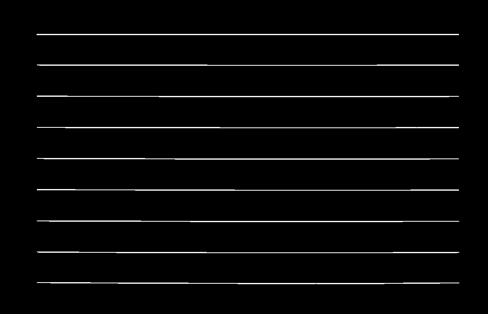

# **Automated Table Detection and Recognition from Scanned Images**

**Project Overview**

The **Automated Table Detection and Recognition from Scanned Images project** is a sophisticated algorithm designed to accurately identify tables within scanned images. Its core objective is to overcome challenges related to diverse layouts, fonts, and varying image quality levels. This algorithm not only excels at locating tables but also seamlessly extracts valuable data from them.

# Key Features

- **Precise Table Identification** : Our algorithm can precisely locate tables within scanned images, even in cases with complex layouts and diverse fonts.

- **Robust Image Quality Handling** : It's capable of handling varying image quality levels, ensuring reliable performance across different scanned documents.

- **Data Extraction** : Beyond table detection, this algorithm excels at extracting data from these tables, making it a comprehensive tool for data analysis.

# Getting Started

These instructions will help you get a copy of the project up and running on your local machine for development and testing purposes.

# Prerequisites

To run this project, you'll need:

- *tesseract-ocr-fra*
- *ultralyticsplus (version 0.0.23)*
- *ultralytics (version 8.0.21)*
- *opencv2*
- *pandas*
- *csv*
- *subprocess*
- *PIL*

# Installation

    git clone https://github.com/oussama95boussaid/Automated_Table_Detection_and_recognition_from_Scanned_Images_PDFs.git
    cd Automated_Table_Detection_and_recognition_from_Scanned_Images_PDFs

# Install the required libraries for linux:

    !sudo apt install tesseract-ocr-fra
    !pip install pytesseract transformers ultralyticsplus==0.0.23 ultralytics==8.0.21

# Run the algorithm:

    python table_detection_and_extraction_Project.py

# Project Stepts :

-  step 1 : Detecting the table 
-  step 2 : Extract table from the image
-  step 3 : Finding the cells & extracting the text using OCR
-  step 4 : Generating The CSV file

# Detecting the table

In the process of our project, we utilized the YOLOv8 model with specific parameter configurations to tackle the critical task of table detection. This step was pivotal in our workflow, as accurate table detection is a fundamental component of various computer vision applications.

To optimize our model's performance, we fine-tuned the following parameters:

- Confidence Threshold (conf): We set this to 0.25, which determined the minimum confidence level a detected object had to meet to be considered valid. Lower values can result in more detections but might also increase false positives.

- Intersection over Union Threshold (iou): We configured this to 0.45, which controlled the overlap allowed between different bounding boxes during Non-Maximum Suppression (NMS). A higher value can lead to more consolidated bounding boxes.

- Class-Agnostic NMS (agnostic_nms): We kept this parameter set to False, meaning that NMS was class-specific. In other words, objects of different classes were treated separately during NMS.

- Maximum Detections per Image (max_det): We limited the number of detections per image to 1000. This helped manage the computational load and memory usage, especially in situations where numerous objects were present in an image.

These parameter settings were meticulously chosen to strike a balance between precision and recall, ensuring that our table detection model performed effectively and efficiently.

After detecting the table that's the result of cropping it from the image based on boxes

# Finding the cells & extracting the text using OCR from the table

**Data Preprocessing**

This stage **Removing The Lines** is mainly to delete table Lines. 

This will help us get a clear picture of the OCR process. In the end, only the text in the table cells remains in the image.

1. **add 10 percent padding** :

   This will be needed in the next stage when we remove the lines Without this, the lines do not get removed fully
 
2. **Grey-scaling & Thresholding &  Inverting** :

   This stage takes the full color image plus padding from the last stage and converts it to an inverted binary image

 Result of step 1 & 2 

 

3. **Eroding Vertical Lines** :

   To understand how vertical lines and all text erode, you need to understand the concepts of "*erosion*" and "*dilation*" properly.*“kernel”* is in the context of erosion and dilation. Basically, it’s a shape that is taken over the images and used to transform the 
   underlying image by removing or adding pixels to the original image.for more information <a href = "https://docs.opencv.org/4.x/dd/dd7/tutorial_morph_lines_detection.html">Extract horizontal and vertical lines by using morphological operations </a>
   

4. **Eroding Horizontal Lines** :

   Similar process to erode away the horizontal lines
   

5. **Combining Vertical And Horizontal Lines** :

   Combine the horizontal and vertical lines using a simple *add* operation. It just adds the white pixels in both image, I used *dilate* once again to “thicken” these lines, befor that i used **getStructuringElement** in order to create a nice simple rectangular 
   kernel. The simple kernel will go over the image and thicken things up
   

6. **Removing The Lines** : 

   Now that we have an image that is only made up of the lines of the table, we can do a “subtract” and get an image without the lines. image that is only made up of the lines of the table, we can do a *subtract* and get an image without the lines.
   

7. **Use Dilation To Convert The Words Into Blobs**

   Convert all the text of the image with only text into blobs, I used long horizontal kernel. That helps us dilate the words and turn them into horizontal smudges.And a square kernel just to fill in any gaps.
   

8. **Find The Contours Of The Blobs** :

   I used **findContours** method, to find where all the blobs are, And draw them on the original image for the purposes of visualization. 
   
   
9. **Convert The Blobs Into Bounding Boxes**

   I used a new OpenCV function called: **boundingRect**,The function takes in the contour (which is made up of many points) and reduces it to a box that can fully enclose the contour shape.
   

10. **Sorting The Bounding Boxes By X And Y Coordinates To Make Rows And Columns** :

    This step is some good old-fashioned logic. No OpenCV is needed. I'm just going to create an array of arrays of the bounding boxes in order to represent the rows and columns of the table.

    Steps :
   
       - Find the average height of the boxes. We are doing this because we want to use the average height to decide if a box is in this row or the next. If we find that y has changed a lot, we are dealing with a box from the next row.
       - sort the boxes by the y coordinate. This will help to make sure that all the boxes in the same row are together.
       - I start making the “row” arrays. I do this by looking at the Y coordinate. If it has changed a lot from the last one, we are in a new row. If it has changed a little we add the box to the same row.
       - In the end, I get an array with sub-arrays representing the rows.
       - Sort all the bounding boxes that make up the rows by the X coordinate. This makes sure that they are all in the correct order within the row

   
11. **Extracting The Text From The Bounding Boxes Using OCR** :

     Loop over all the rows and start to make little image slices based on the bounding boxes. Each slice will have a word. I save the image and then run **TesseractOCR** on it.Then I save  all the image slices to a file and then we are calling the Tesseract command 
     line tool.

     Each of the image slices with a single word look something like this:
    
     
12. **Generating The CSV** 
13. **Result** :

    

   

